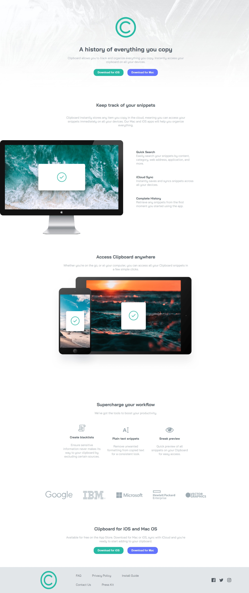

# Frontend Mentor - Clipboard landing page solution

This is a solution to the [Clipboard landing page challenge on Frontend Mentor](https://www.frontendmentor.io/challenges/clipboard-landing-page-5cc9bccd6c4c91111378ecb9). Frontend Mentor challenges help you improve your coding skills by building realistic projects.

## Overview

### The challenge

Users should be able to:

- View the optimal layout for the site depending on their device's screen size
- See hover states for all interactive elements on the page

### Screenshot

### Links

- Solution URL: [Solution link](https://www.frontendmentor.io/solutions/clipboard-landing-page-ZduUFwHAO_)
- Live Site URL: [Clipboard landing page](https://clipboard-landing-page-dazai.netlify.app/)

### Built with

- Semantic HTML5 markup
- CSS custom properties
- Flexbox
- CSS Grid

## Author

- Website - [Yusif Ayman](https://yussif20.github.io/main-portfolio/)
- Github - [Yusif Ayman](https://github.com/Yussif20)
- Linkedin - [Yusif Ayman](https://www.linkedin.com/in/yussif-ayman/)
- Frontend Mentor - [Yusif Ayman](https://www.frontendmentor.io/profile/Yussif20)
